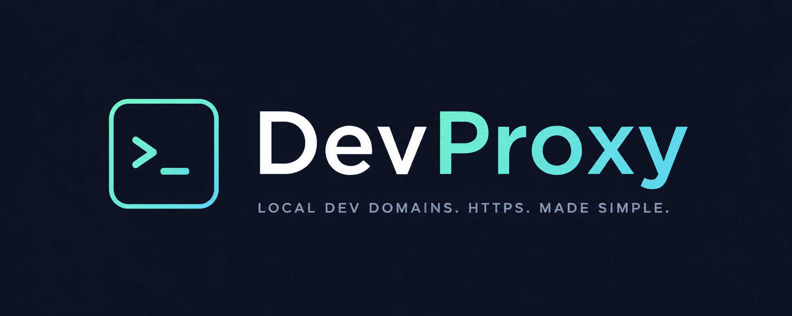

# DevProxy

### Stable HTTPS `.local` domains for local development

[](https://www.npmjs.com/package/@maxiviper117/devproxy)  [](LICENSE) [](package.json) [](package.json) [](tsconfig.json)

DevProxy is a cross-platform CLI for stable HTTPS `.local` domains that proxy to local development services on Windows, macOS, and Linux. On Windows, it also works well with apps running in WSL, Docker, or native Windows processes as long as the service is reachable through loopback.

## Documentation

Full documentation is hosted at [https://maxiviper117.github.io/dev-proxy/](https://maxiviper117.github.io/dev-proxy/).

## Quick Start

1. Install [Caddy](https://caddyserver.com/) and trust its CA:

   ```powershell
   scoop install caddy
   caddy trust
   ```

   On macOS, `brew install caddy` is the common install path. On Linux, use the official packages for your distribution. See the docs for the full Windows, macOS, and Linux setup guide.

2. Install DevProxy:

   ```bash
   npm install -g @maxiviper117/devproxy
   ```

3. Run your local project on a port (for example, `8000`).


> [!IMPORTANT]
> **Elevated permissions required:** This next step (4) modifies your system hosts file, so you must run it in an **administrator / elevated terminal session** (Windows: run Terminal/PowerShell as Administrator; macOS/Linux: use `sudo`).
4. Register the service:


   **Option A — Quick registration (can be run from anywhere):**

   ```bash
   devproxy add api.myapp --port 8000
   ```

   **Option B — Project-scoped registration (run inside your project directory):**

   ```bash
   devproxy init --name api.myapp --port 8000
   ```

   `init` does two things:
   1. **Registers the service globally** (same as `add`) — adds the domain to DevProxy's registry, updates your hosts file, and reloads Caddy.
   2. **Creates `.devproxy/config.json`** in your current directory, saving the service `name` and `port`.

   Because the config lives in your project, you can re-run `devproxy init` later without remembering the original flags. Commit `.devproxy/config.json` to version control so your team can run the same command to set up the project locally.

5. Open your domain:

   ```text
   https://api.myapp.local
   ```

> [!TIP] 
> If you registered with `init`, you can also run `devproxy open` from your project root (where `.devproxy/config.json` exists) and it will open the domain directly in your browser.

## Commands

 | Command | Description |
| --- | --- |
| `devproxy init --name <name> --port <port>` | Register a service and create project config in one step |
| `devproxy add <name> --port <port>` | Register a new service |
| `devproxy open [name]` | Open a service in your browser |
| `devproxy list` | List all registered services |
| `devproxy status` | Report Caddy state and upstream health |
| `devproxy remove <name>` | Remove a registered service |
| `devproxy doctor` | Check setup and diagnostics |
| `devproxy start` | Start or reload Caddy |
| `devproxy stop` | Stop Caddy |

## Requirements

- Windows, macOS, or Linux
- Node.js 22 or newer
- Caddy installed and available on `PATH`
- Local services reachable from the host running DevProxy

## License

[MIT](LICENSE)
